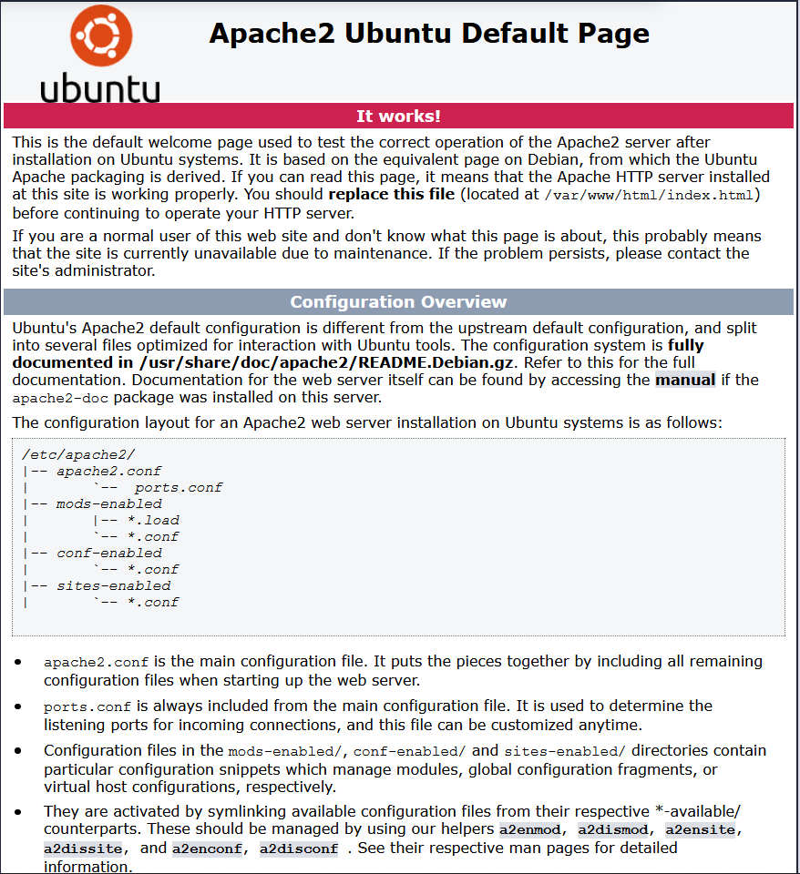

## Modul 300 LB2 Dokumentation
# Einleitung

In der LB2 ging es darum, einen Service durch ein Vagrant-File und Git-Bash zu erstellen.
Hier habe ich mich für einen einfachen Apache-Server entschieden, da es einfach zu erstellen ist und auch einfach zu verstehen ist. Schliesslich ist dies das erste Mal, dass ich mit Vagrant arbeite.

# Prerequisiten
Damit man mit Vagrant einen Service zum laufen bringen kann, braucht man erst gewisse Programme die dies ermöglichen. Als erstes braucht man einen Account im Git-Hub. Zusätzlich muss man Git-Bash herunterladen, da hiermit schlussendlich die Befehle eingegeben werden, um das Projekt durchzusetzen. Schlussendlich habe ich mich noch für Atom als Editr-Umgebung entschiede, da man hier einerseits die Befehle editieren kann und es zusätzlich die Navigation zwischen Ordnern vereinfacht.

# Erstellen und Starten der VM

Als erstes muss im Git-Bash ins Verzeichnis navigiert werden, in dem das Vagrant-File ist:
```sh
$ cd /d/Schule/TBZ/Modul300/Modul300-lb2/web/" 
```
Danach muss man das Vagrant File per Befehl laufen lassen:
```sh
$ vagrant up
```
Nachdem kann man im Git-Bash zuschauen, wie erst die VM und dann der Apache-Service installiert wird.

# Beschreibung Vagrant-File
Als erstes wird mit folgendem Befehl gesagt, dass nun die Config folgt
```sh
Vagrant.configure(2) do |config|
```
Nun wird hier der Name der VM definiert.
```sh
  config.vm.box = "ubuntu/xenial64"
```
Hier wird der Port definiert, durch den schlussendlich die Webseite erreichbar ist.
```sh
  config.vm.network "forwarded_port", guest:80, host:8080, auto_correct: true
```
Hier wird definiert, von wo das HTML-File bezogen wird.
```sh
  config.vm.synced_folder ".", "/var/www/html"
```
Hier wird gesagt, dass nun eine Konfiguration der VM selbst folgt.
```sh
config.vm.provider "virtualbox" do |vb|
```
Mit diesem Befehl wird die Speichergrösse in MB definiert.
```sh
  vb.memory = "512"
```
Hier ist die Konfiguration der VM beendet.
```sh
end
```
Hier werden nun die Packages vom lokalen Server geholt. Dies wird im SHELL gemacht.
```sh
config.vm.provision "shell", inline: <<-SHELL
```
Hier wird der Pfad angegeben, von wo die Sources genommen werden.
```sh
  /etc/apt/sources.list
```
Hier wird die Ubuntu-Maschine updated.
```sh
  sudo apt-get update
```
Hier wird nun der Apache-Service installiert.
```sh
  sudo apt-get -y install apache2
```
Hier ist der Teil im Shell beendet.
```sh
SHELL
```
Das Vagrant File ist nun beendet.
```sh
end
```

# Endprodukt
Schliesslich kann man über den Link http://localhost:8080 die Default-Webseite des Apache öffnen.


